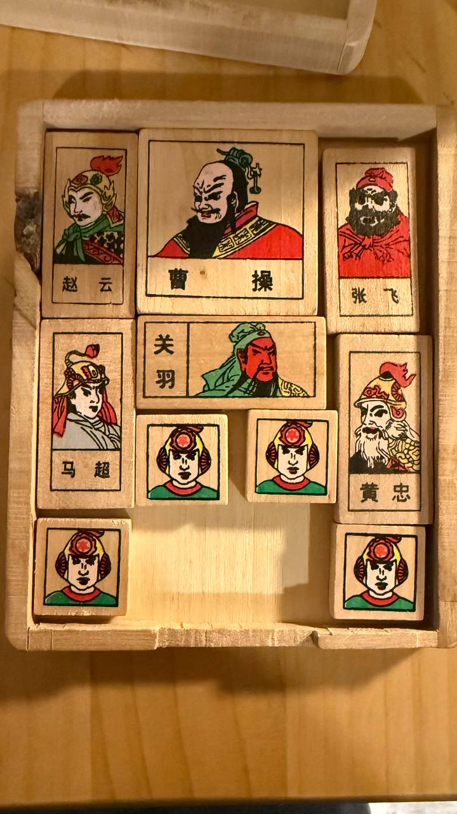

# Three Kingdoms Huarong Path Puzzle Solver

Written by claude.ai sonnet 4.5



A solver for the classic [Huarong Path (华容道)](https://en.wikipedia.org/wiki/Klotski) sliding block puzzle, using BFS with smart canonical state deduplication to find optimal solutions.

## Installation

This project uses [uv](https://docs.astral.sh/uv/) for Python dependency management.

```bash
# Clone the repository
git clone https://github.com/vors/huarong_path_puzzle.git
cd huarong_path_puzzle

# Install dependencies (including dev dependencies for testing)
uv sync --extra dev
```

## Usage

### Using Preset Boards

The solver includes 3 preset puzzle configurations:

```bash
# Solve preset 1 (default)
uv run python solver.py --preset 1

# Solve preset 2
uv run python solver.py --preset 2

# Solve preset 3
uv run python solver.py --preset 3
```

### Using Custom Boards

You can provide your own board configuration:

```bash
# Comma-separated rows
uv run python solver.py --board "ABBC,ABBC,DEEX,DYZX,K..I"

# Newline-separated rows (in quotes)
uv run python solver.py --board "ABBC
ABBC
DEEX
DYZX
K..I"
```

### Board Format

- The board is a 4x5 grid of characters
- Each letter represents a piece (pieces with the same letter are connected)
- `.` represents an empty cell
- The 2x2 piece (Cao Cao) is the main piece that needs to reach the bottom center
- The goal is reached when the 2x2 piece occupies positions (3,1), (3,2), (4,1), (4,2)

## Running Tests

```bash
# Install dev dependencies if not already installed
uv sync --extra dev

# Run all tests
uv run pytest

# Run tests with verbose output
uv run pytest -v

# Run a specific test class
uv run pytest test_solver.py::TestSolvePuzzle -v

# Run a specific test
uv run pytest test_solver.py::TestSolvePuzzle::test_solve_preset_1 -v
```

## How It Works

The solver uses **Breadth-First Search (BFS)** to explore all possible moves and find the shortest solution. To improve efficiency, it uses **canonical state deduplication** - pieces of the same shape are treated as interchangeable, significantly reducing the search space.

### Piece Types

- **2x2** (1 piece): The main piece (Cao Cao) that must reach the goal
- **1x2** (4 pieces): Vertical rectangular pieces
- **2x1** (1 piece): Horizontal rectangular piece  
- **1x1** (4 pieces): Small square pieces

## License

MIT License - see [LICENSE](./LICENSE) for details.
